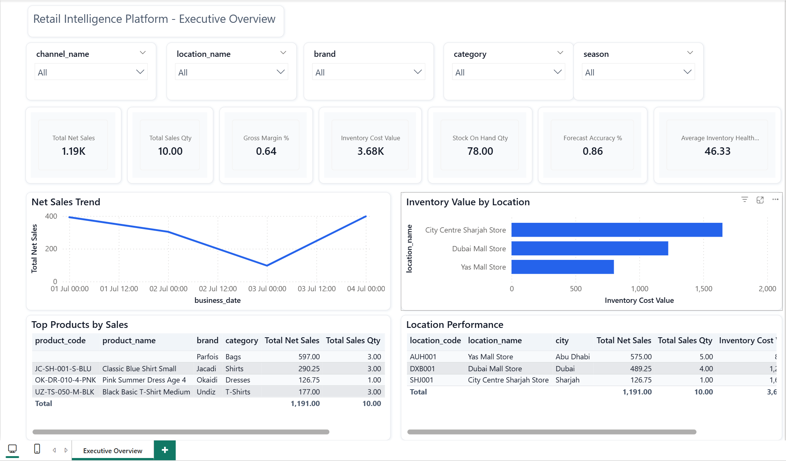
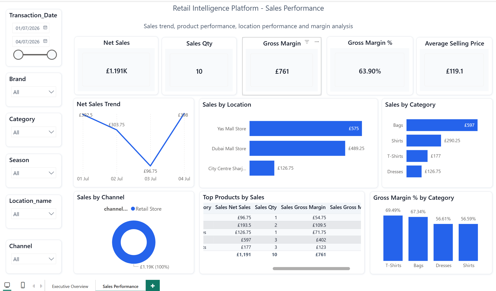
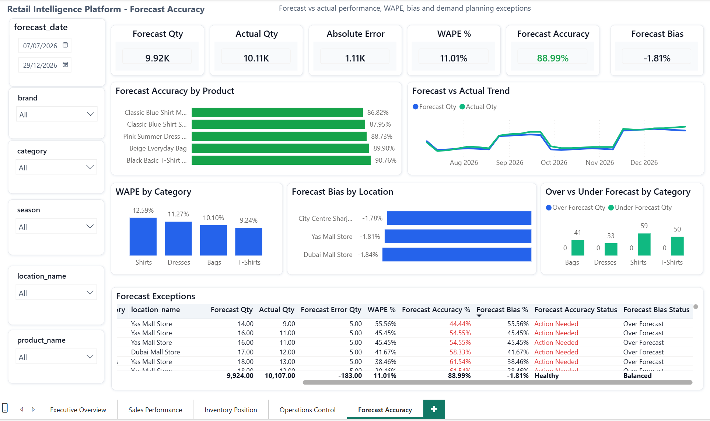
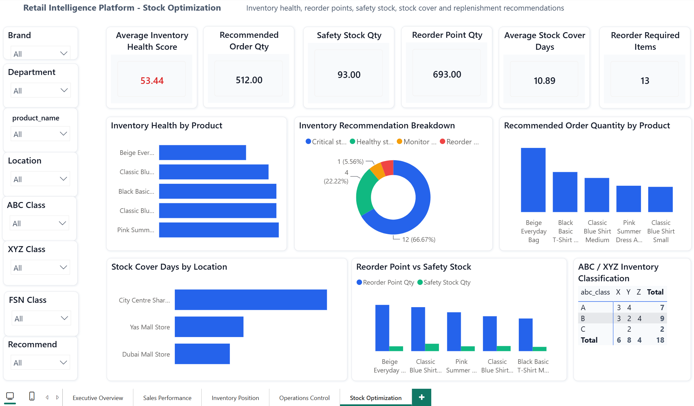

<!-- PORTFOLIO_HEADER_START -->

<p align="center">
  <h1 align="center">📊 Retail Intelligence Platform</h1>
  <p align="center">
    End-to-End Retail Data Warehouse, Python ETL, Data Quality Validation, Audit Logging, and Power BI Analytics Platform
  </p>
</p>

<p align="center">
  
  
  
  
  
  
  
</p>

---

<!-- PORTFOLIO_HEADER_END -->

## Portfolio Summary

Retail Intelligence Platform is a professional end-to-end analytics engineering project designed for fashion retail, inventory control, supply chain analytics, merchandise planning, demand planning, and business intelligence.

The platform simulates a real enterprise retail data workflow that reads operational Excel and ERP-style files, validates data quality, loads SQL Server staging tables, executes warehouse stored procedures, and exposes Power BI-ready mart views.

This project demonstrates practical skills in:

- Retail analytics and supply chain reporting
- Python ETL development
- SQL Server data warehouse design
- Data validation and quality controls
- Audit logging and operational monitoring
- Error reporting and rejected file handling
- Power BI dashboard development
- Forecast accuracy analysis
- Stock optimization and replenishment logic
- GitHub-ready project documentation

---

## Table of Contents

- [1. Project Overview](#1-project-overview)
- [2. Business Problem](#2-business-problem)
- [3. Business Objective](#3-business-objective)
- [4. High-Level Architecture](#4-high-level-architecture)
- [5. Power BI Dashboard Preview](#5-power-bi-dashboard-preview)
- [6. Project Folder Structure](#6-project-folder-structure)
- [7. Technology Stack](#7-technology-stack)
- [8. Supported Source Files](#8-supported-source-files)
- [9. SQL Server Database Design](#9-sql-server-database-design)
- [10. Data Warehouse Model](#10-data-warehouse-model)
- [11. ETL Pipeline Flow](#11-etl-pipeline-flow)
- [12. Validation Framework](#12-validation-framework)
- [13. Audit, Logs, and Reports](#13-audit-logs-and-reports)
- [14. File Movement Logic](#14-file-movement-logic)
- [15. Power BI Data Model Approach](#15-power-bi-data-model-approach)
- [16. Mart Views for Power BI](#16-mart-views-for-power-bi)
- [17. Dashboard Pages](#17-dashboard-pages)
- [18. Business Metrics Supported](#18-business-metrics-supported)
- [19. Forecast Accuracy Logic](#19-forecast-accuracy-logic)
- [20. Stock Optimization Logic](#20-stock-optimization-logic)
- [21. Setup Instructions](#21-setup-instructions)
- [22. Run ETL Pipeline](#22-run-etl-pipeline)
- [23. Testing Commands](#23-testing-commands)
- [24. SQL Audit Queries](#24-sql-audit-queries)
- [25. GitHub Actions CI](#25-github-actions-ci)
- [26. Important Project Files](#26-important-project-files)
- [27. Current Progress](#27-current-progress)
- [28. Roadmap](#28-roadmap)
- [29. Portfolio Explanation](#29-portfolio-explanation)
- [30. Interview Explanation](#30-interview-explanation)
- [31. Author](#31-author)

---

## 1. Project Overview

**Retail Intelligence Platform** is an end-to-end enterprise analytics project designed for fashion retail, merchandise planning, inventory control, supply chain analytics, demand planning, and business intelligence.

The project simulates a real retail company environment where operational data comes from ERP systems, Excel files, warehouse records, sales transactions, stock snapshots, purchase orders, goods receipts, store transfers, forecast files, and stock optimization outputs.

The goal of the project is to convert fragmented operational data into a clean, validated, auditable, Power BI-ready SQL Server Data Warehouse.

---

## 2. Business Problem

Retail companies often manage data across disconnected systems and Excel files.

Typical problems include:

- No single version of truth
- Manual Excel reporting
- Delayed visibility of stock and sales
- Poor stock allocation decisions
- Difficulty tracking purchase orders and goods receipts
- Weak transfer visibility between stores and warehouses
- Limited forecast accuracy tracking
- Overstock and stockout situations
- No proper validation before reporting
- No audit trail for file processing
- No rejected-row investigation process
- No structured foundation for Power BI dashboards

---

## 3. Business Objective

The objective of this project is to build a professional retail analytics platform that can:

1. Read operational Excel source files.
2. Standardize and validate incoming data.
3. Reject bad data before it reaches the warehouse.
4. Load clean data into SQL Server staging tables.
5. Execute stored procedures to populate warehouse dimensions and facts.
6. Refresh Power BI-ready mart views.
7. Track every ETL batch with audit tables.
8. Save full technical logs for troubleshooting.
9. Generate Excel run summary reports.
10. Generate error reports for rejected rows.
11. Move successful files to processed folders.
12. Move failed files to rejected folders.
13. Provide Power BI dashboards for retail decision-making.
14. Create a scalable foundation for forecasting, optimization, and AI analytics.

---

## 4. High-Level Architecture

```text
Excel / ERP Source Files
        ↓
Python ETL Pipeline
        ↓
Schema Validation
        ↓
Data Quality Validation
        ↓
SQL Server Staging Tables
        ↓
SQL Stored Procedures
        ↓
SQL Server Data Warehouse
        ↓
Mart Views
        ↓
Power BI Dashboards
        ↓
Forecasting + Inventory Optimization + AI Assistant
```

---

## 5. Power BI Dashboard Preview

The Retail Intelligence Platform includes a professional Power BI reporting layer built on top of SQL Server mart views.

Each dashboard page uses standalone analytics-ready mart tables designed for fast dashboarding and business storytelling.

---

### Executive Overview

The Executive Overview page provides a high-level view of retail business performance, including sales, margin, inventory value, stock cover, and executive KPI indicators.



---

### Sales Performance

The Sales Performance page analyzes revenue, units sold, gross margin, product/category contribution, and store-level sales performance.



---

### Forecast Accuracy

The Forecast Accuracy page compares forecast demand against actual sales and highlights forecast accuracy, WAPE, bias, absolute error, and demand planning exceptions.



---

### Stock Optimization

The Stock Optimization page focuses on inventory health, safety stock, reorder points, stock cover days, ABC/XYZ/FSN classification, and replenishment recommendations.



---

## 6. Project Folder Structure

```text
Retail_Intelligence_Platform
│
├── 01_database_design/
│   └── sql_scripts/
│
└── 02_python_etl/
    │
    ├── audit/
    │   └── audit_logger.py
    │
    ├── config/
    │   ├── column_mapping.py
    │   ├── database_config.py
    │   ├── file_config.py
    │   └── pipeline_config.py
    │
    ├── docs/
    │   ├── ARCHITECTURE.md
    │   ├── ETL_RUNBOOK.md
    │   ├── INTERVIEW_NOTES.md
    │   ├── POWER_BI_DASHBOARD_PLAN.md
    │   ├── POWER_BI_MEASURES_PLAN.md
    │   ├── POWER_BI_DATA_CONNECTION_LOADING_GUIDE.md
    │   └── POWER_BI_EXECUTIVE_DASHBOARD_BUILD_GUIDE.md
    │
    ├── error_reports/
    ├── extract/
    │   └── read_excel.py
    │
    ├── input_files/
    │   ├── product_master/
    │   ├── location_master/
    │   ├── supplier_master/
    │   ├── sales/
    │   ├── inventory_snapshot/
    │   ├── inventory_movement/
    │   ├── purchase_orders/
    │   ├── goods_receipts/
    │   ├── transfers/
    │   ├── forecast/
    │   └── stock_optimization/
    │
    ├── load/
    │   ├── sql_connection.py
    │   ├── staging_loader.py
    │   └── dw_loader.py
    │
    ├── logs/
    ├── powerbi/
    │   ├── Retail_Intelligence_Platform.pbix
    │   ├── dashboard_theme.json
    │   ├── executive_dashboard_measures.dax
    │   ├── forecast_accuracy_advanced_measures.dax
    │   └── stock_optimization_additional_measures.dax
    │
    ├── processed_files/
    ├── rejected_files/
    ├── reports/
    ├── screenshots/
    ├── sql/
    │   └── demo_data/
    ├── tests/
    ├── utils/
    ├── validate/
    ├── main.py
    ├── requirements.txt
    ├── ROADMAP.md
    ├── README.md
    └── .env.example
```

---

## 7. Technology Stack

| Layer | Technology |
|---|---|
| Source Files | Excel |
| ETL Orchestration | Python |
| Data Processing | pandas, openpyxl |
| SQL Connectivity | SQLAlchemy, pyodbc |
| Database | Microsoft SQL Server |
| Warehouse Design | Staging, DW, Mart Views |
| Validation | Python Validation Framework |
| Audit | SQL Server Audit Tables |
| Logs | Python Log Files |
| Reports | Excel Run Summary Reports |
| BI Layer | Power BI |
| Version Control | Git, GitHub |
| Automation | GitHub Actions |

---

## 8. Supported Source Files

| File Type | Folder |
|---|---|
| Product Master | `input_files/product_master` |
| Location Master | `input_files/location_master` |
| Supplier Master | `input_files/supplier_master` |
| Sales | `input_files/sales` |
| Inventory Snapshot | `input_files/inventory_snapshot` |
| Inventory Movement | `input_files/inventory_movement` |
| Purchase Orders | `input_files/purchase_orders` |
| Goods Receipts | `input_files/goods_receipts` |
| Transfers | `input_files/transfers` |
| Forecast | `input_files/forecast` |
| Stock Optimization | `input_files/stock_optimization` |

---

## 9. SQL Server Database Design

The SQL Server database uses multiple schemas to separate responsibilities.

| Schema | Purpose |
|---|---|
| `raw` | Original raw data layer |
| `stg` | Validated staging data |
| `dw` | Dimensional data warehouse |
| `mart` | Reporting and Power BI views |
| `audit` | ETL audit logs and error tracking |

---

## 10. Data Warehouse Model

The warehouse is designed using dimensional modeling principles.

### Dimension Tables

| Dimension | Purpose |
|---|---|
| `dw.dim_product` | Product, style, barcode, season, color, size |
| `dw.dim_location` | Stores, warehouses, countries, regions |
| `dw.dim_supplier` | Supplier master information |
| `dw.dim_calendar` | Date intelligence |
| `dw.dim_channel` | Sales channels |
| `dw.dim_promotion` | Promotion information |
| `dw.dim_movement_type` | Inventory movement type |
| `dw.dim_status` | Transaction and document statuses |
| `dw.dim_forecast_model` | Forecast model metadata |
| `dw.dim_optimization_model` | Stock optimization model metadata |

### Fact Tables

| Fact Table | Business Grain |
|---|---|
| `dw.fact_sales` | One sales transaction line |
| `dw.fact_inventory_snapshot` | One product-location-date stock snapshot |
| `dw.fact_inventory_movement` | One inventory movement document line |
| `dw.fact_purchase_orders` | One purchase order line |
| `dw.fact_goods_receipts` | One goods receipt document line |
| `dw.fact_transfers` | One transfer document line |
| `dw.fact_forecast` | One forecast record per product-location-period |
| `dw.fact_stock_optimization` | One optimization result per product-location-run |

---

## 11. ETL Pipeline Flow

The Python ETL pipeline performs the following steps:

```text
1. Read source Excel files
2. Standardize column names
3. Validate required columns
4. Validate required values
5. Validate date fields
6. Validate numeric fields
7. Validate allowed values
8. Validate duplicate business keys
9. Validate business rules
10. Load clean data to SQL Server staging tables
11. Execute SQL Server DW stored procedures
12. Run post-load validation
13. Generate SQL audit records
14. Generate technical log file
15. Generate Excel run summary report
16. Generate error report if validation fails
17. Move successful files to processed_files
18. Move rejected files to rejected_files
```

---

## 12. Validation Framework

The project includes three validation layers.

### Schema Validation

Schema validation checks that required columns exist in each source file.

Examples:

- Product code must exist in product master.
- Sales transaction ID must exist in sales file.
- Purchase order number must exist in purchase order file.
- Transfer order number must exist in transfer file.

### Data Quality Validation

Data quality validation checks:

- Missing required values
- Invalid dates
- Invalid numeric values
- Negative values where not allowed
- Duplicate business keys
- Invalid status codes
- Business rule mismatches

Examples:

- Sales net amount must match gross amount minus discount.
- Inventory cost value must match stock quantity multiplied by unit cost.
- Completed transfer shortage must match shipped quantity minus received quantity.
- In-transit transfers are not treated as shortages.

### Post-Load Validation

Post-load validation checks whether the warehouse was loaded correctly.

It validates:

- Audit batch status
- File log count
- Fact table row counts
- Mart view row counts

---

## 13. Audit, Logs, and Reports

The project has three evidence layers.

| Evidence Type | Location | Purpose |
|---|---|---|
| SQL Audit Tables | `audit` schema | Operational database history |
| Technical Logs | `logs` folder | Full troubleshooting trace |
| Excel Summary Reports | `reports` folder | Business-friendly run summary |
| Error Reports | `error_reports` folder | Rejected row investigation |

### SQL Audit Tables

| Table | Purpose |
|---|---|
| `audit.etl_batch_log` | One row per ETL batch |
| `audit.etl_file_log` | One row per file type processed |
| `audit.data_quality_error_log` | Rejected row details |

---

## 14. File Movement Logic

After successful ETL:

```text
input_files → processed_files
```

After failed validation:

```text
input_files → rejected_files
```

Folder structure:

```text
processed_files/<file_type>/<batch_id>/<source_file>
rejected_files/<file_type>/<batch_id>/<source_file>
```

---

## 15. Power BI Data Model Approach

For this portfolio version, Power BI uses **standalone mart views**.

Each mart view is already analytics-ready and contains the required descriptive fields and KPI columns.

Correct dashboard rule:

```text
One dashboard page = one mart view
One mart view = one standalone report table
No relationships between mart views
```

This avoids incorrect relationships between repeated descriptive fields such as:

- brand
- department
- category
- product_name
- location_name

These fields are used as slicers and reporting attributes, not primary keys.

A future advanced version can introduce a full star schema model using:

- dim_date
- dim_product
- dim_location
- dim_supplier
- dim_channel

---

## 16. Mart Views for Power BI

Power BI connects directly to the `mart` views.

| Mart View | Power BI Table | Purpose |
|---|---|---|
| `mart.vw_executive_kpi_base` | Executive KPI | Executive KPI reporting |
| `mart.vw_sales_performance` | Sales Performance | Sales reporting |
| `mart.vw_inventory_position` | Inventory Position | Inventory position |
| `mart.vw_latest_inventory_position` | Latest Inventory Position | Latest stock view |
| `mart.vw_inventory_movement_analysis` | Inventory Movement | Inventory movement analysis |
| `mart.vw_purchase_order_analysis` | Purchase Orders | Purchase order monitoring |
| `mart.vw_goods_receipt_analysis` | Goods Receipts | Goods receipt tracking |
| `mart.vw_transfer_analysis` | Transfers | Transfer analysis |
| `mart.vw_forecast_accuracy` | Forecast Accuracy | Forecast accuracy analysis |
| `mart.vw_stock_optimization` | Stock Optimization | Optimization recommendations |

---

## 17. Dashboard Pages

| Dashboard Page | Main Table Used | Status | Focus Area |
|---|---|---|---|
| Executive Overview | Executive KPI | Completed | Business performance summary |
| Sales Performance | Sales Performance | Completed | Sales, revenue, margin, product/store contribution |
| Forecast Accuracy | Forecast Accuracy | Completed | Forecast vs actual, WAPE, bias, accuracy |
| Stock Optimization | Stock Optimization | Completed | Safety stock, reorder point, ABC/XYZ/FSN, recommendations |
| Inventory Position | Inventory Position / Latest Inventory Position | In Progress | Stock on hand, stock value, stock cover |
| Operations Control | Purchase Orders, Goods Receipts, Transfers, Inventory Movement | In Progress | PO, GRN, transfer and movement control |

---

## 18. Business Metrics Supported

### Sales Metrics

- Sales quantity
- Gross sales amount
- Discount amount
- Net sales amount
- VAT amount
- Cost amount
- Gross margin amount
- Gross margin percentage
- Average selling price

### Inventory Metrics

- Stock on hand
- Available stock
- Reserved stock
- In-transit stock
- On-order quantity
- Inventory cost value
- Inventory retail value
- Stock cover days

### Purchase Order Metrics

- Ordered quantity
- Cancelled quantity
- Open quantity
- Remaining quantity
- Ordered cost value

### Goods Receipt Metrics

- Received quantity
- Accepted quantity
- Rejected quantity
- Short quantity
- Excess quantity
- Defect quantity
- Received cost value

### Transfer Metrics

- Requested transfer quantity
- Shipped quantity
- Received quantity
- Short quantity
- Excess quantity
- In-transit quantity
- Transfer cost value
- Transfer retail value

### Forecast Metrics

- Forecast quantity
- Actual quantity
- Forecast error
- Absolute error
- Squared error
- MAPE percentage
- Bias percentage
- Forecast accuracy percentage
- WAPE percentage

### Stock Optimization Metrics

- Average daily sales
- Demand standard deviation
- Lead time days
- Service level
- Safety stock quantity
- Reorder point quantity
- Recommended order quantity
- Stock cover days
- ABC classification
- XYZ classification
- FSN classification
- Inventory health score
- Replenishment recommendation

---

## 19. Forecast Accuracy Logic

The platform calculates forecast performance using demand planning metrics.

```text
Forecast Error = Actual Qty - Forecast Qty

Absolute Error = ABS(Actual Qty - Forecast Qty)

WAPE % = Absolute Error Qty / Actual Qty

Forecast Accuracy % = 1 - WAPE %

Forecast Bias % = Forecast Error Qty / Actual Qty
```

Accuracy status rule:

```text
Green  = Forecast Accuracy >= 85%
Amber  = Forecast Accuracy between 70% and 84.99%
Red    = Forecast Accuracy below 70%
```

Bias interpretation:

```text
Positive Bias = Actual higher than forecast = Under forecast
Negative Bias = Actual lower than forecast = Over forecast
```

---

## 20. Stock Optimization Logic

The stock optimization module supports inventory replenishment decisions using:

- Average daily sales
- Demand standard deviation
- Lead time days
- Service level
- Safety stock
- Reorder point
- Recommended order quantity
- Stock cover days
- Inventory health score

Example decision logic:

```text
Low stock cover + recommended order qty > 0
        → Reorder recommended

High stock cover + no recommended order qty
        → Monitor overstock risk

Very low stock cover
        → Critical stockout risk
```

Inventory health status rule:

```text
Green  = Inventory Health Score >= 80
Amber  = Inventory Health Score between 60 and 79.99
Red    = Inventory Health Score below 60
```

---

## 21. Setup Instructions

### Create Virtual Environment

From the `02_python_etl` folder:

```powershell
python -m venv .venv
```

Activate:

```powershell
.venv\Scripts\activate
```

### Install Requirements

```powershell
python -m pip install -r requirements.txt
```

### Configure Environment

Copy `.env.example` to `.env` and update your SQL Server connection details.

Example:

```env
DB_SERVER=localhost\SQLEXPRESS
DB_NAME=RetailIntelligenceDW
DB_DRIVER=ODBC Driver 17 for SQL Server
DB_AUTH_MODE=windows
DB_TRUST_SERVER_CERTIFICATE=yes
```

---

## 22. Run ETL Pipeline

Generate sample Excel files:

```powershell
python -m utils.generate_sample_excel_files
```

Run ETL without moving source files:

```powershell
python main.py --skip-file-move
```

Run full ETL:

```powershell
python main.py
```

Show command help:

```powershell
python main.py --help
```

Common run modes:

```powershell
python main.py --env test
python main.py --skip-file-move
python main.py --skip-post-validation
python main.py --skip-mart-validation
python main.py --no-clear-staging
python main.py --batch-id 262001105
```

---

## 23. Testing Commands

Test SQL Server connection:

```powershell
python -m tests.test_sql_connection
```

Test ETL configuration:

```powershell
python -m tests.test_etl_config
```

Test Excel reader:

```powershell
python -m tests.test_read_all_excel_files
```

Test schema validation:

```powershell
python -m tests.test_schema_validation
```

Test data quality checks:

```powershell
python -m tests.test_data_quality_checks
```

Test staging load:

```powershell
python -m tests.test_load_staging
```

Test DW load:

```powershell
python -m tests.test_load_dw
```

Test post-load validation:

```powershell
python -m tests.test_post_load_validation
```

Test error report generation:

```powershell
python -m tests.test_error_report_export
```

Run Python compile checks:

```powershell
python -m py_compile main.py
python -m compileall audit
python -m compileall config
python -m compileall extract
python -m compileall load
python -m compileall tests
python -m compileall utils
python -m compileall validate
```

---

## 24. SQL Audit Queries

Use these queries in SQL Server to check ETL history.

```sql
USE RetailIntelligenceDW;
GO

SELECT TOP 10 *
FROM audit.etl_batch_log
ORDER BY started_at DESC;

SELECT TOP 50 *
FROM audit.etl_file_log
ORDER BY created_at DESC;

SELECT TOP 50 *
FROM audit.data_quality_error_log
ORDER BY created_at DESC;
```

Check forecast and optimization demo data:

```sql
USE RetailIntelligenceDW;
GO

SELECT 'dw.fact_forecast' AS table_name, COUNT(*) AS row_count
FROM dw.fact_forecast

UNION ALL

SELECT 'mart.vw_forecast_accuracy' AS table_name, COUNT(*) AS row_count
FROM mart.vw_forecast_accuracy

UNION ALL

SELECT 'dw.fact_stock_optimization' AS table_name, COUNT(*) AS row_count
FROM dw.fact_stock_optimization

UNION ALL

SELECT 'mart.vw_stock_optimization' AS table_name, COUNT(*) AS row_count
FROM mart.vw_stock_optimization;
```

---

## 25. GitHub Actions CI

The project includes a GitHub Actions workflow for Python syntax validation.

Workflow file:

```text
.github/workflows/python-ci.yml
```

The CI checks:

- Main Python file compilation
- Package/module compilation
- Basic syntax integrity
- Repository health before portfolio review

---

## 26. Important Project Files

| File | Purpose |
|---|---|
| `main.py` | Main ETL pipeline entry point |
| `requirements.txt` | Python dependencies |
| `README.md` | Project overview and portfolio documentation |
| `ROADMAP.md` | Future development roadmap |
| `docs/ARCHITECTURE.md` | Technical architecture |
| `docs/ETL_RUNBOOK.md` | ETL operating guide |
| `docs/INTERVIEW_NOTES.md` | Interview explanation notes |
| `docs/POWER_BI_DASHBOARD_PLAN.md` | Power BI dashboard planning |
| `docs/POWER_BI_MEASURES_PLAN.md` | Power BI measures planning |
| `docs/POWER_BI_DATA_CONNECTION_LOADING_GUIDE.md` | Power BI loading guide |
| `powerbi/Retail_Intelligence_Platform.pbix` | Main Power BI report file |
| `powerbi/dashboard_theme.json` | Power BI dashboard theme |
| `screenshots/` | Dashboard screenshots |
| `sql/demo_data/expand_forecast_stock_optimization_demo.sql` | Demo data expansion script |

---

## 27. Current Progress

Completed:

- SQL Server database creation
- Database schemas
- Core dimensions
- Core fact tables
- Staging tables
- DW load stored procedures
- Mart views
- Sample Excel data generator
- Python virtual environment
- SQL Server connection
- Excel reader
- Schema validation
- Data quality validation
- SQL staging loader
- DW procedure executor
- Main ETL runner
- Audit logging
- Error report export
- Processed/rejected file movement
- Post-load validation
- Environment-based configuration
- Command-line arguments
- Professional logging system
- Pipeline run summary report
- GitHub repository setup
- GitHub Actions CI
- Power BI dashboard theme
- Executive Overview dashboard
- Sales Performance dashboard
- Forecast Accuracy dashboard
- Stock Optimization dashboard
- Dashboard screenshots added to README

Current build:

```text
Build 46: Add Dashboard Screenshots to README
```

Next planned build:

```text
Build 47: Final Power BI Documentation and User Guide
```

---

## 28. Roadmap

Next phases:

1. Final Power BI documentation and user guide
2. Project QA checklist and portfolio review
3. GitHub Release v1.0
4. CV and interview explanation pack
5. Advanced forecasting engine using Python
6. Inventory optimization model enhancements
7. Streamlit or web app layer
8. AI Supply Chain Assistant
9. Cloud deployment

---

## 29. Portfolio Explanation

This project demonstrates the ability to design and build a full retail analytics platform from source files to reporting-ready dashboards.

It includes:

- Business problem understanding
- Retail data modeling
- SQL Server data warehouse design
- Python ETL orchestration
- Data validation
- Audit logging
- Error handling
- File processing automation
- Reporting outputs
- Power BI-ready mart views
- Power BI dashboards
- Command-line execution
- Environment-based configuration
- GitHub version control
- Project documentation

This is more than a dashboard project. It is a complete data engineering and analytics foundation for retail operations.

---

## 30. Interview Explanation

A concise interview explanation:

> I built an end-to-end Retail Intelligence Platform for fashion retail analytics. The project reads ERP-style Excel files, validates schema and data quality, loads clean data into SQL Server staging tables, executes stored procedures to populate a dimensional warehouse, and exposes mart views for Power BI dashboards. I also added audit tables, technical logs, Excel run summary reports, rejected row reports, processed/rejected file movement, environment configuration, command-line controls, GitHub Actions CI, and dashboard documentation. The platform supports sales, inventory, purchase orders, goods receipts, transfers, forecast accuracy, and stock optimization analytics.

---

## 31. Author

**Kabir / Abrar Hussain**

Inventory Controller | Junior Data Analyst | Power BI Developer | Retail Analytics Portfolio Builder

Focus areas:

- Retail analytics
- Inventory control
- Demand planning
- Merchandise planning
- Power BI dashboarding
- SQL Server reporting
- Python ETL automation
- Supply chain analytics

---

## Repository

GitHub Repository:

```text
https://github.com/kabir12771/retail-intelligence-platform
```

---

## Final Note

The Retail Intelligence Platform is designed as a realistic, business-focused portfolio project that connects retail operations, data engineering, analytics, and Power BI storytelling into one professional end-to-end solution.